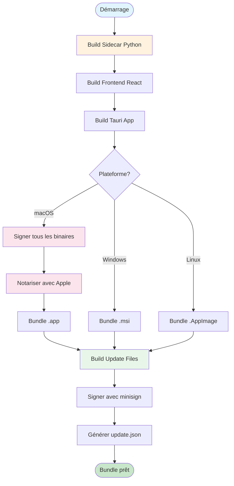
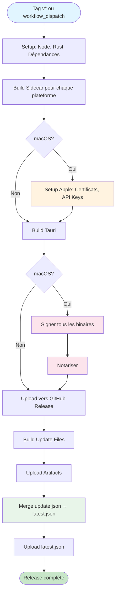
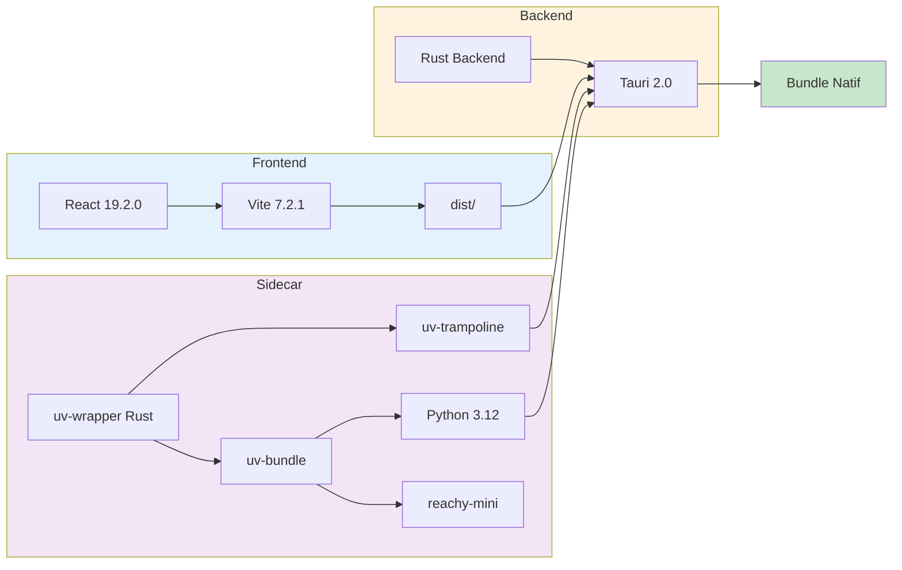
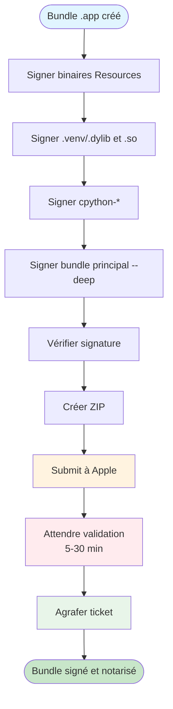
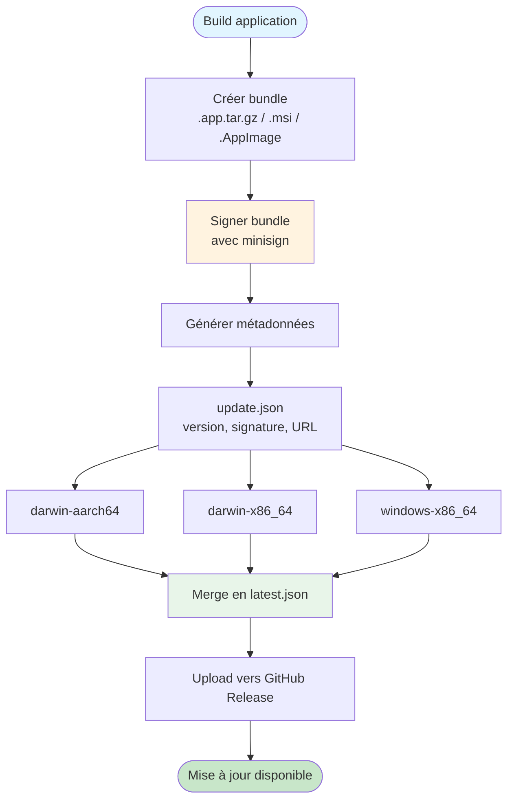

# Rapport sur le Processus de Build

## Vue d'ensemble

Ce document décrit en détail le processus de build de l'application **Reachy Mini Control**, une application desktop cross-platform construite avec Tauri 2.0, React, et un sidecar Python embarqué.

## Diagramme de Flux



### Flux CI/CD (GitHub Actions)



### Architecture des Composants



### Processus de Signature macOS



### Système de Mise à Jour



---

## 1. Architecture Générale

### 1.1 Stack Technologique

- **Frontend**: React 19.2.0 + Vite 7.2.1
- **Backend**: Tauri 2.0 (Rust)
- **Sidecar**: Python 3.12 avec `uv` (gestionnaire de paquets Python)
- **Bundling**: Tauri Bundle (app, msi, appimage)
- **Mise à jour**: Tauri Updater avec signatures minisign

### 1.2 Structure du Projet

```
tauri-app/
├── src/                    # Frontend React
├── src-tauri/              # Backend Rust + config Tauri
├── uv-wrapper/             # Wrapper Rust pour bundler Python
├── scripts/                # Scripts de build et utilitaires
└── .github/workflows/      # GitHub Actions CI/CD
```

---

## 2. Build du Sidecar Python

### 2.1 Vue d'ensemble

Le sidecar est un environnement Python complet embarqué dans l'application, incluant :
- Python 3.12
- `uv` (gestionnaire de paquets)
- `reachy-mini[placo_kinematics]` (SDK du robot)
- Un environnement virtuel Python (`.venv`)

### 2.2 Composants du Sidecar

#### 2.2.1 `uv-wrapper` (Rust)

Le projet `uv-wrapper` contient deux binaires Rust :

1. **`uv-bundle`** : Installe et bundle l'environnement Python
   - Télécharge et installe `uv` localement
   - Installe Python 3.12 via `uv`
   - Crée un environnement virtuel `.venv`
   - Installe les dépendances Python (`reachy-mini[placo_kinematics]`)
   - Supporte deux sources pour `reachy-mini` :
     - `pypi` (par défaut) : depuis PyPI
     - `develop` : depuis GitHub (branche develop)

2. **`uv-trampoline`** : Wrapper pour exécuter des commandes Python
   - Trouve automatiquement `uv` et Python dans le bundle
   - Configure les variables d'environnement nécessaires
   - Lance les commandes Python via `uv`

#### 2.2.2 Scripts de Build

**Unix (macOS/Linux)** : `scripts/build/build-sidecar-unix.sh`
```bash
# Étapes :
1. Nettoie le dossier de destination (src-tauri/binaries)
2. Build uv-bundle en release
3. Exécute uv-bundle pour installer Python + dépendances
4. Build uv-trampoline en release
5. Copie uv-trampoline avec suffixe du triplet (ex: uv-trampoline-aarch64-apple-darwin)
```

**Windows** : `scripts/build/build-sidecar-windows.ps1`
- Équivalent PowerShell du script Unix

### 2.3 Variables d'Environnement

- `REACHY_MINI_SOURCE` : Source pour `reachy-mini`
  - `pypi` (défaut) : Installation depuis PyPI
  - `develop` : Installation depuis GitHub (branche develop)

### 2.4 Structure du Bundle Sidecar

Après le build, `src-tauri/binaries/` contient :
```
binaries/
├── uv                    # Binaire uv
├── uvx                   # Binaire uvx
├── uv-trampoline-<triplet>  # Wrapper Rust
├── .venv/                # Environnement virtuel Python
│   ├── bin/              # Scripts Python
│   └── lib/              # Bibliothèques Python
└── cpython-3.12.12-<platform>/  # Distribution Python
```

### 2.5 Intégration dans Tauri

Le sidecar est référencé dans `tauri.conf.json` :
```json
{
  "bundle": {
    "externalBin": ["binaries/uv-trampoline"]
  }
}
```

Et dans `tauri.macos.conf.json` pour macOS :
```json
{
  "bundle": {
    "resources": {
      "binaries/uv": "uv",
      "binaries/uvx": "uvx",
      "binaries/.venv": ".venv",
      "binaries/cpython-3.12.12-macos-aarch64-none": "cpython-3.12.12-macos-aarch64-none"
    }
  }
}
```

---

## 3. Build de l'Application Tauri

### 3.1 Configuration Tauri

**Fichier principal** : `src-tauri/tauri.conf.json`

- **Version** : 0.2.1
- **Identifier** : `com.pollen-robotics.reachy-mini`
- **Product Name** : "Reachy Mini Control"
- **Targets** : `["app", "msi", "appimage"]` (macOS app, Windows MSI, Linux AppImage)

### 3.2 Processus de Build

#### 3.2.1 Frontend (Vite)

**Configuration** : `vite.config.js`
- **Target** : `['es2021', 'chrome100', 'safari13']`
- **Minification** : `esbuild` (sauf en mode debug)
- **Sourcemaps** : Activés en mode debug
- **Port dev** : 1420

**Commandes** :
```bash
yarn build          # Build frontend uniquement
yarn tauri:build    # Build complet (frontend + Tauri)
```

#### 3.2.2 Backend (Tauri)

**Build script** : `src-tauri/build.rs`
- Simple wrapper qui appelle `tauri_build::build()`

**Commandes Tauri** :
```bash
yarn tauri build                    # Build release
yarn tauri build --debug            # Build debug
yarn tauri build --target <triplet> # Build pour une cible spécifique
```

**Étapes du build Tauri** :
1. Build du frontend (via `beforeBuildCommand`)
2. Compilation Rust
3. Bundling des ressources
4. Création du bundle natif (app/msi/appimage)

### 3.3 Configuration macOS Spécifique

**Fichier** : `src-tauri/tauri.macos.conf.json`

- **Signing Identity** : `"-"` (configuré via variables d'environnement)
- **Minimum System Version** : 10.15
- **Entitlements** : `entitlements.plist`
- **Info.plist** : `Info.plist`

**Entitlements** (`entitlements.plist`) :
- Réseau (serveur + client)
- Accès fichiers (user-selected, downloads)
- Exécution de processus enfants (sidecar Python)
- Accès USB/série

**Info.plist** :
- Permissions réseau locales
- Descriptions d'utilisation
- Configuration Python (`PYTHONUNBUFFERED`)

---

## 4. Signature et Notarisation (macOS)

### 4.1 Certificats Apple

#### 4.1.1 Types de Certificats

- **Developer ID Application** : Pour distribution hors App Store
- Format : `.p12` (PKCS12) ou `.cer` (DER)

#### 4.1.2 Configuration Locale

**Script** : `scripts/signing/setup-apple-signing.sh`

Variables d'environnement configurées :
- `APPLE_CERTIFICATE` : Certificat encodé en base64
- `APPLE_CERTIFICATE_PASSWORD` : Mot de passe du certificat (.p12)
- `APPLE_SIGNING_IDENTITY` : Identité de signature (ex: "Developer ID Application: Name (TEAM_ID)")
- `APPLE_TEAM_ID` : Team ID Apple (10 caractères)

**Script de préparation** : `scripts/signing/prepare-github-secrets.sh`
- Extrait les informations du certificat
- Génère les valeurs base64 pour GitHub Secrets
- Aide à configurer les secrets GitHub Actions

### 4.2 Processus de Signature

#### 4.2.1 Signature des Binaires

**Script** : `scripts/signing/sign-all-binaries.sh`

Ce script signe récursivement tous les binaires Mach-O dans le bundle :

1. **Binaires dans Resources** :
   - `uv`, `uvx`
   - Binaires dans `MacOS/`

2. **Bibliothèques Python** :
   - Tous les `.dylib` dans `.venv`
   - Tous les `.so` (extensions Python natives)
   - Binaires exécutables dans `.venv/bin`

3. **Distribution Python** :
   - Binaires dans `cpython-*`

4. **Bundle principal** :
   - Signature finale avec `--deep`

**Commande codesign** :
```bash
codesign --force --verify --verbose --sign "$SIGNING_IDENTITY" \
  --options runtime \
  --timestamp \
  --deep \
  "$APP_BUNDLE"
```

#### 4.2.2 Notarisation

**Outils** : `xcrun notarytool` (App Store Connect API)

**Processus** :
1. Création d'un ZIP du bundle
2. Soumission à Apple via `notarytool`
3. Attente de la validation (timeout 30min)
4. Agrafage du ticket de notarisation (`stapler staple`)

**Configuration requise** :
- `APPLE_API_KEY` : Key ID (10 caractères)
- `APPLE_API_ISSUER` : Issuer ID (UUID)
- `APPLE_API_KEY_CONTENT` : Clé privée .p8 (PEM)

---

## 5. Système de Mise à Jour

### 5.1 Architecture

- **Plugin** : `tauri-plugin-updater`
- **Signature** : minisign (Ed25519)
- **Format** : JSON avec signatures par plateforme

### 5.2 Génération des Mises à Jour

**Script** : `scripts/build/build-update.sh`

**Usage** :
```bash
./scripts/build-update.sh [dev|prod] [version]
```

**Étapes** :

1. **Build de l'application** :
   - Mode debug (dev) ou release (prod)
   - Support cross-compilation via `TARGET_TRIPLET`

2. **Création du bundle** :
   - **macOS** : `.app.tar.gz` (archive tar.gz du .app)
   - **Windows** : `.msi`
   - **Linux** : `.AppImage`

3. **Signature** :
   - Utilise `tauri signer` ou `minisign`
   - Clé privée : `~/.tauri/reachy-mini.key`
   - Génère un fichier `.sig`

4. **Génération des métadonnées** :
   - Crée `update.json` avec :
     - Version
     - Notes
     - Date de publication
     - Signatures et URLs par plateforme

**Structure `update.json`** :
```json
{
  "version": "0.2.1",
  "notes": "Update for version 0.2.1",
  "pub_date": "2024-01-01T00:00:00Z",
  "platforms": {
    "darwin-aarch64": {
      "signature": "<base64-signature>",
      "url": "https://releases.example.com/reachy-mini-control_0.2.1_darwin-aarch64.app.tar.gz"
    }
  }
}
```

### 5.3 Configuration dans Tauri

**Fichier** : `src-tauri/tauri.conf.json`

```json
{
  "plugins": {
    "updater": {
      "active": true,
      "endpoints": [
        "https://github.com/pollen-robotics/reachy-mini-desktop-app/releases/latest/download/latest.json"
      ],
      "pubkey": "<public-key-base64>"
    }
  }
}
```

### 5.4 Clés de Signature

**Génération** :
```bash
yarn tauri signer generate -w ~/.tauri/reachy-mini.key
```

**Format** :
- Clé privée : `~/.tauri/reachy-mini.key`
- Clé publique : `~/.tauri/reachy-mini.key.pub` (encodée en base64 dans `tauri.conf.json`)

---

## 6. GitHub Actions CI/CD

### 6.1 Workflow Principal

**Fichier** : `.github/workflows/release-unified.yml`

**Déclencheurs** :
- Push de tag `v*`
- `workflow_dispatch` (manuel avec version optionnelle)

### 6.2 Matrice de Build

**Plateformes** :
- `macos-latest` → `aarch64-apple-darwin` (Apple Silicon)
- `macos-latest` → `x86_64-apple-darwin` (Intel Mac)
- `windows-latest` → `x86_64-pc-windows-msvc`

### 6.3 Étapes du Workflow

#### 6.3.1 Setup

1. **Checkout code**
2. **Setup Node.js 24** (avec cache Yarn)
3. **Setup Rust** (avec targets pour cross-compilation)
4. **Install dependencies** (`yarn install`)

#### 6.3.2 Build Sidecar

- **Unix** : `scripts/build/build-sidecar-unix.sh` avec `TARGET_TRIPLET`
- **Windows** : `scripts/build/build-sidecar-windows.ps1`

#### 6.3.3 Configuration Apple (macOS uniquement)

**Setup Code Signing** :
1. Import du certificat `.p12` dans un keychain temporaire
2. Configuration des variables d'environnement :
   - `APPLE_CERTIFICATE` (base64)
   - `APPLE_CERTIFICATE_PASSWORD`
   - `APPLE_SIGNING_IDENTITY`
   - `APPLE_TEAM_ID`

**Setup App Store Connect API** :
1. Configuration de la clé API pour notarisation
2. Variables :
   - `APPLE_API_KEY` (Key ID)
   - `APPLE_API_ISSUER` (Issuer ID)
   - `APPLE_API_KEY_CONTENT` (clé privée .p8)

#### 6.3.4 Setup Tauri Signing Key

1. Création de `~/.tauri/reachy-mini.key` depuis `TAURI_SIGNING_KEY`
2. Création de `~/.tauri/reachy-mini.key.pub` depuis `TAURI_PUBLIC_KEY`
3. Si non fourni, génération d'une clé temporaire

#### 6.3.5 Extraction de Version

- Depuis le tag Git (`v*`)
- Ou depuis `workflow_dispatch` input
- Ou depuis `tauri.conf.json`

#### 6.3.6 Build Tauri

- **macOS** : `yarn tauri build --target <target>` (sans notarisation automatique)
- **Windows** : `yarn tauri build --target <target>`

#### 6.3.7 Signature et Notarisation (macOS uniquement)

1. **Signature de tous les binaires** :
   - Exécute `scripts/signing/sign-all-binaries.sh`
   - Vérifie que tous les binaires sont signés

2. **Notarisation** :
   - Crée un ZIP du bundle
   - Soumet avec `xcrun notarytool`
   - Agrafe le ticket

#### 6.3.8 Création de Release GitHub

1. **Premier job** (aarch64-apple-darwin) :
   - Crée la release GitHub
   - Upload les artifacts

2. **Autres jobs** :
   - Upload vers la release existante

#### 6.3.9 Build des Mises à Jour

1. Exécute `scripts/build/build-update.sh prod <version>`
2. Upload les artifacts `update-*` (JSON + bundles signés)

#### 6.3.10 Création du Manifeste de Mise à Jour

**Job séparé** : `create-update-manifest`

1. Télécharge tous les artifacts `update-*`
2. Merge tous les `update.json` en un seul `latest.json`
3. Upload `latest.json` vers la release GitHub

**Structure `latest.json`** :
```json
{
  "version": "0.2.1",
  "notes": "...",
  "pub_date": "...",
  "platforms": {
    "darwin-aarch64": { "signature": "...", "url": "..." },
    "darwin-x86_64": { "signature": "...", "url": "..." },
    "windows-x86_64": { "signature": "...", "url": "..." }
  }
}
```

### 6.4 Secrets GitHub Requis

> **Note** : Voir aussi la section 4.1.2 pour la configuration locale des certificats Apple.

#### 6.4.1 Apple Code Signing

- `APPLE_CERTIFICATE` : Certificat .p12 encodé en base64
- `APPLE_CERTIFICATE_PASSWORD` : Mot de passe du certificat
- `APPLE_SIGNING_IDENTITY` : Identité de signature complète
- `APPLE_TEAM_ID` : Team ID (10 caractères)

#### 6.4.2 App Store Connect API

- `APPLE_API_KEY` : Key ID (10 caractères)
- `APPLE_API_ISSUER` : Issuer ID (UUID)
- `APPLE_API_KEY_CONTENT` : Clé privée .p8 (PEM, peut être base64)

#### 6.4.3 Tauri Updater

- `TAURI_SIGNING_KEY` : Clé privée minisign (base64)
- `TAURI_PUBLIC_KEY` : Clé publique minisign (base64, optionnel)

#### 6.4.4 Release URL (optionnel)

- `RELEASE_URL_BASE` : URL de base pour les téléchargements (défaut: GitHub Releases)

---

## 7. Commandes de Build Locales

### 7.1 Développement

```bash
# Dev frontend uniquement
yarn dev

# Dev Tauri (avec hot reload)
yarn tauri:dev

# Dev en mode simulation
yarn tauri:dev:sim
```

### 7.2 Build Sidecar

```bash
# Build sidecar (PyPI)
yarn build:sidecar-macos
yarn build:sidecar-linux

# Build sidecar (GitHub develop)
yarn build:sidecar-macos:develop
yarn build:sidecar-linux:develop
```

### 7.3 Build Application

```bash
# Build production
yarn tauri:build

# Build pour une cible spécifique
yarn tauri build --target aarch64-apple-darwin
yarn tauri build --target x86_64-apple-darwin
yarn tauri build --target x86_64-pc-windows-msvc
```

### 7.4 Build Mises à Jour

```bash
# Build mise à jour dev (test local)
yarn build:update:dev

# Build mise à jour prod
yarn build:update:prod [version]

# Servir les mises à jour localement
yarn serve:updates
```

### 7.5 Tests

```bash
# Test sidecar
yarn test:sidecar

# Test application
yarn test:app

# Test updater
yarn test:updater

# Tous les tests
yarn test:all
```

---

## 8. Points d'Attention et Bonnes Pratiques

### 8.1 Sidecar

- **Taille** : Le bundle Python peut être volumineux (~200-500 MB)
- **Cross-compilation** : Le sidecar doit être buildé pour chaque plateforme cible
- **Dépendances** : `reachy-mini[placo_kinematics]` inclut des dépendances natives (compilation requise)

### 8.2 Signature macOS

- **Ordre** : Signer d'abord les binaires individuels, puis le bundle avec `--deep`
- **Notarisation** : Nécessite un compte Apple Developer payant
- **Temps** : La notarisation peut prendre 5-30 minutes

### 8.3 Mises à Jour

- **Clés** : Garder les clés privées sécurisées (jamais dans le repo)
- **Versioning** : Suivre le semver pour les versions
- **URLs** : S'assurer que les URLs de téléchargement sont accessibles publiquement

### 8.4 GitHub Actions

- **Secrets** : Tous les secrets doivent être configurés avant le premier build
- **Timeout** : La notarisation peut nécessiter un timeout long (30min)
- **Artifacts** : Les artifacts sont conservés 30 jours par défaut

---

## 9. Résumé du Flux de Build Complet

### 9.1 Build Local

1. Build sidecar → `src-tauri/binaries/`
2. Build frontend → `dist/`
3. Build Tauri → `src-tauri/target/<target>/release/bundle/`
4. (macOS) Signature manuelle → `scripts/signing/sign-all-binaries.sh`
5. (macOS) Notarisation manuelle → `xcrun notarytool`
6. Build mise à jour → `scripts/build/build-update.sh`

### 9.2 Build CI/CD (GitHub Actions)

1. **Setup** : Node, Rust, dépendances
2. **Build sidecar** : Pour chaque plateforme
3. **Setup Apple** : Certificats, clés API
4. **Build Tauri** : Pour chaque plateforme
5. **Signature/Notarisation** : macOS uniquement
6. **Release GitHub** : Upload des bundles
7. **Build updates** : Génération des fichiers de mise à jour
8. **Manifeste** : Merge et upload de `latest.json`

---

## 10. Fichiers de Configuration Clés

### 10.1 Configuration Principale

| Fichier | Description |
|---------|-------------|
| `package.json` | Scripts npm/yarn, dépendances frontend |
| `vite.config.js` | Configuration Vite (build frontend) |
| `src-tauri/Cargo.toml` | Dépendances Rust, configuration Cargo |
| `src-tauri/tauri.conf.json` | Configuration principale Tauri |
| `src-tauri/tauri.macos.conf.json` | Configuration spécifique macOS |
| `src-tauri/entitlements.plist` | Permissions macOS |
| `src-tauri/Info.plist` | Métadonnées macOS |
| `uv-wrapper/Cargo.toml` | Configuration du wrapper Python |

### 10.2 Scripts de Build

| Fichier | Description | Localisation |
|---------|-------------|--------------|
| `scripts/build/build-sidecar-unix.sh` | Script build sidecar Unix (macOS/Linux) | ✅ `scripts/build/` |
| `scripts/build/build-sidecar-windows.ps1` | Script build sidecar Windows | ✅ `scripts/build/` |
| `scripts/build/build-update.sh` | Script génération mises à jour | ✅ `scripts/build/` |

### 10.3 Scripts de Signature

| Fichier | Description | Localisation |
|---------|-------------|--------------|
| `scripts/signing/sign-all-binaries.sh` | Script signature macOS | ✅ `scripts/signing/` |
| `scripts/signing/setup-apple-signing.sh` | Script config signature locale | ✅ `scripts/signing/` |
| `scripts/signing/prepare-github-secrets.sh` | Script préparation secrets GitHub | ✅ `scripts/signing/` |

### 10.4 Scripts de Test

| Fichier | Description | Localisation |
|---------|-------------|--------------|
| `scripts/test/test-app.sh` | Test application complète | ✅ `scripts/test/` |
| `scripts/test/test-daemon-develop.sh` | Test avec version develop | ✅ `scripts/test/` |
| `scripts/test/test-sidecar.sh` | Test sidecar Python | ✅ `scripts/test/` |
| `scripts/test/test-update-prod.sh` | Test mises à jour prod | ✅ `scripts/test/` |
| `scripts/test/test-updater.sh` | Test système de mise à jour | ✅ `scripts/test/` |

### 10.5 Scripts Daemon

| Fichier | Description | Localisation |
|---------|-------------|--------------|
| `scripts/daemon/check-daemon.sh` | Vérification état daemon | ✅ `scripts/daemon/` |
| `scripts/daemon/kill-daemon.sh` | Arrêt du daemon | ✅ `scripts/daemon/` |

### 10.6 Scripts Utilitaires

| Fichier | Description | Localisation |
|---------|-------------|--------------|
| `scripts/utils/serve-updates.sh` | Serveur local pour tests | ✅ `scripts/utils/` |
| `scripts/utils/remove-black-background.py` | Utilitaire traitement images | ✅ `scripts/utils/` |

### 10.7 CI/CD

| Fichier | Description |
|---------|-------------|
| `.github/workflows/release-unified.yml` | Workflow CI/CD principal |

### 10.8 Organisation des Scripts

✅ **Organisation améliorée** : Tous les scripts sont maintenant organisés en sous-dossiers logiques :

- **`scripts/build/`** : Scripts de build (sidecar, updates)
- **`scripts/signing/`** : Scripts de signature et certificats
- **`scripts/test/`** : Scripts de test
- **`scripts/daemon/`** : Scripts de gestion du daemon
- **`scripts/utils/`** : Scripts utilitaires

Voir `scripts/README.md` pour plus de détails.

---

## Conclusion

Le processus de build de Reachy Mini Control est complexe mais bien structuré :

- **Sidecar Python** : Bundle complet avec `uv` et Python
- **Tauri** : Framework moderne pour apps desktop cross-platform
- **Signature/Notarisation** : Conformité macOS avec Developer ID
- **Mises à jour** : Système automatique avec signatures
- **CI/CD** : Automatisation complète via GitHub Actions

Le système supporte le développement local, les builds de production, et la distribution automatique via GitHub Releases.

### Points d'Amélioration Identifiés

1. ✅ **Organisation des scripts** : Réorganisés en sous-dossiers logiques (`build/`, `signing/`, `test/`, `daemon/`, `utils/`)
2. **Documentation** : Le rapport est complet mais pourrait bénéficier d'un index/table des matières pour navigation rapide
3. **Exemples pratiques** : Ajouter des exemples de commandes complètes pour des scénarios courants (premier build, build cross-platform, etc.)

