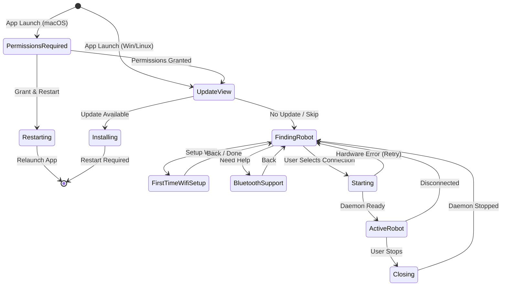

<div align="center">
  <a href="https://huggingface.co/spaces?q=reachy_mini">
    
  </a>
  
  <h1>Reachy Mini Control</h1>
  
  <p>
    
    
    
    
  </p>
</div>

A modern desktop application for controlling and monitoring your Reachy Mini robot. Built with Tauri and React for a native, performant experience.

> **📢 Platform Support**  
> ✅ **macOS** - Fully supported and production-ready  
> 🚧 **Windows & Linux** - Work in progress, not yet ready for production use

This desktop application provides a unified interface to manage your Reachy Mini robot. It handles the robot daemon lifecycle, offers real-time 3D visualization of the robot's state, and includes an integrated app store to discover and install applications from Hugging Face Spaces. The app automatically detects USB-connected robots and provides direct access to audio controls, camera feeds, and robot choreographies.


## ✨ Features

- 🤖 **Robot Control** - Start, stop, and monitor your Reachy Mini daemon
- 📊 **Real-time Monitoring** - Live 3D visualization of robot state
- 🏪 **Application Store** - Discover, install, and manage apps from Hugging Face Spaces
  - Browse official and community apps
  - Search and filter by categories
  - One-click installation and removal
  - Start and stop apps directly from the interface
- 📚 **Create Your Own Apps** - Tutorials and guides to build custom applications
  - Learn how to interact with the daemon API
  - Build apps with the Python SDK
  - Deploy and share on Hugging Face Spaces
- 🔄 **Auto Updates** - Seamless automatic updates with progress tracking
- 🎨 **Modern UI** - Clean, intuitive interface built with Material-UI
  - Dark mode support
  - Responsive design
- 🔌 **USB Detection** - Automatic detection of Reachy Mini via USB
- 📱 **Cross-platform** - Works on macOS, Windows, and Linux

## 🚀 Quick Start

### Prerequisites

- **Node.js 24.4.0+** (LTS recommended) and Yarn
  - If using `nvm`: `nvm install --lts && nvm use --lts`
- Rust (latest stable)
- System dependencies for Tauri ([see Tauri docs](https://v2.tauri.app/start/prerequisites/))

### Installation

```bash
# Clone the repository
git clone https://github.com/pollen-robotics/reachy-mini-desktop-app.git
cd reachy-mini-desktop-app/reachy_mini_desktop_app

# Install dependencies
yarn install

# Run in development mode
yarn tauri:dev
```

```bash
# Check your Node version
node --version

# If using nvm, install and use the latest LTS
nvm install --lts
nvm use --lts
nvm alias default $(nvm version)  # Set as default
```

### Building

**Important**: You must build the sidecar before building the application.

```bash
# 1. Build the sidecar (required first step)
yarn build:sidecar-macos    # macOS
yarn build:sidecar-linux    # Linux
yarn build:sidecar-windows  # Windows

# 2. Build the application
yarn tauri:build            # Build for production (uses PyPI release by default)

# Build for specific platform
yarn tauri build --target aarch64-apple-darwin
yarn tauri build --target x86_64-apple-darwin
yarn tauri build --target x86_64-pc-windows-msvc
yarn tauri build --target x86_64-unknown-linux-gnu
```

#### Installing the daemon from different sources

By default, the `reachy-mini` package is installed from PyPI (latest stable release). You can also install from any GitHub branch by using the `REACHY_MINI_SOURCE` environment variable:

- **PyPI (default)** : `REACHY_MINI_SOURCE=pypi` or omit the variable
- **GitHub branch** : `REACHY_MINI_SOURCE=<branch-name>` (e.g., `develop`, `main`, `feature/xyz`)

Examples to build the sidecar with different sources:
```bash
# Build with develop branch
REACHY_MINI_SOURCE=develop bash ./scripts/build/build-sidecar-unix.sh

# Build with main branch
REACHY_MINI_SOURCE=main bash ./scripts/build/build-sidecar-unix.sh

# Build with any other branch
REACHY_MINI_SOURCE=feature/my-feature bash ./scripts/build/build-sidecar-unix.sh
```

## 📖 Documentation

- [Scripts Directory](./scripts/README.md) - Organization and usage of build scripts
- [Code Signing](./docs/CODE_SIGNING_REPORT.md) - macOS and Windows code signing documentation
- [Update System](./docs/README.md) - Auto-updater and GitHub Pages deployment
- [Technical Context](./CONTEXT.md) - Hardware specs, streaming, and technical reference
- [Kinematics WASM](./kinematics-wasm/README.md) - WebAssembly kinematics module

### Application Store

The application includes a built-in store for discovering and installing apps:

- **Discover Apps**: Browse apps from Hugging Face Spaces tagged with `reachy_mini`
- **Install & Manage**: Install, uninstall, start, and stop apps with a simple interface
- **Search & Filter**: Find apps by name or filter by categories
- **Create Apps**: Access tutorials to learn how to build your own Reachy Mini applications

Apps are managed through the FastAPI daemon API, which handles installation and execution.

## 🛠️ Development

### Available Scripts

**Development:**
```bash
yarn dev                    # Start Vite dev server only
yarn tauri:dev              # Run Tauri app in dev mode
```

**Building:**
```bash
# Build sidecar (required before tauri:build)
yarn build:sidecar-macos              # macOS (PyPI)
yarn build:sidecar-linux              # Linux (PyPI)
yarn build:sidecar-windows            # Windows (PyPI)

# Build sidecar with specific branch
yarn build:sidecar-macos:develop      # macOS with develop branch
yarn build:sidecar-macos:main         # macOS with main branch
yarn build:sidecar:branch             # Interactive branch selection

# Build application
yarn tauri:build                      # Build production bundle

# Build web dashboard (for daemon)
yarn build:web                        # Build web version
yarn deploy:daemon-v2                 # Deploy to daemon dashboard
```

**Updates:**
```bash
yarn build:update:dev       # Build update files for local testing
yarn build:update:prod      # Build update files for production
yarn serve:updates          # Serve updates locally for testing
```

**Testing:**
```bash
yarn test:sidecar           # Test the sidecar build
yarn test:app               # Test the complete application
yarn test:updater           # Test the update system
yarn test:update-prod       # Test production updates
yarn test:all               # Run all tests
```

**Utilities:**
```bash
yarn check-daemon           # Check daemon status and health
yarn kill-daemon            # Stop all running daemon processes
yarn kill-zombie-apps       # Kill zombie app processes
yarn reset-permissions      # Reset macOS permissions (dev)
yarn clean                  # Clean build artifacts
```

### 🔧 Debugging & Diagnostics

**Diagnostic Export (Secret Shortcut):**

Press `Cmd+Shift+D` (Mac) or `Ctrl+Shift+D` (Windows/Linux) anywhere in the app to download a complete diagnostic report. This generates a `.txt` file containing:

- System info (OS, app version, screen size, etc.)
- Robot state (connection mode, status, daemon version, errors)
- Installed apps list
- All frontend logs (last 500)
- All daemon logs
- All app logs (last 500)

**DevTools Access:**
```javascript
// In browser console
window.reachyDiagnostic.download()      // Download as JSON
window.reachyDiagnostic.downloadText()  // Download as readable TXT
window.reachyDiagnostic.copy()          // Copy JSON to clipboard
window.reachyDiagnostic.generate()      // Get report object
```

This is useful for:
- Bug reports and support tickets
- Debugging connection issues
- Analyzing app crashes
- Sharing logs with the development team

### Project Structure

```
reachy_mini_desktop_app/
├── src/                              # Frontend React code
│   ├── components/                   # Reusable React components
│   │   ├── viewer3d/                # 3D robot visualization (README.md)
│   │   ├── emoji-grid/              # Emotion wheel and emoji display
│   │   ├── camera/                  # Camera components
│   │   ├── LogConsole/              # Log display components
│   │   ├── Toast/                   # Toast notifications
│   │   ├── wifi/                    # WiFi configuration components
│   │   ├── App.jsx                  # Main application component
│   │   └── AppTopBar.jsx            # Top bar with controls
│   ├── hooks/                        # Custom React hooks (organized by domain)
│   │   ├── audio/                   # Audio hooks (useDoA)
│   │   ├── daemon/                  # Daemon lifecycle hooks
│   │   │   ├── useDaemon.js         # Start/stop daemon
│   │   │   ├── useDaemonHealthCheck.js  # Health monitoring
│   │   │   ├── useDaemonEventBus.js # Event bus for daemon events
│   │   │   └── useStartupStages.js  # Startup stage tracking
│   │   ├── media/                   # Media hooks
│   │   │   ├── useAudioAnalyser.js  # Audio analysis
│   │   │   └── useWebRTCStream.js   # WebRTC streaming
│   │   ├── robot/                   # Robot state hooks
│   │   │   ├── useRobotState.js     # Robot state polling
│   │   │   ├── useRobotCommands.js  # Robot command execution
│   │   │   └── useActiveMoves.js    # Active moves tracking
│   │   └── system/                  # System hooks
│   │       ├── useUpdater.js        # Auto-update management
│   │       ├── useUsbDetection.js   # USB robot detection
│   │       ├── usePermissions.js    # macOS permissions
│   │       ├── useViewRouter.jsx    # View state machine
│   │       ├── useRobotDiscovery.js # Robot discovery (WiFi/mDNS)
│   │       └── useNetworkStatus.js  # Network connectivity
│   ├── views/                        # Main application views
│   │   ├── update/                  # Update checking view
│   │   ├── permissions-required/    # Permissions view (macOS)
│   │   ├── finding-robot/           # Connection selection view
│   │   ├── first-time-wifi-setup/   # WiFi setup wizard
│   │   ├── bluetooth-support/       # Bluetooth help view
│   │   ├── starting/                # Hardware scan view
│   │   ├── closing/                 # Shutdown view
│   │   ├── windows/                 # Multi-window management
│   │   └── active-robot/            # Active robot view
│   │       ├── application-store/   # App store (README.md)
│   │       ├── controller/          # Robot controller (README.md)
│   │       ├── audio/               # Audio controls
│   │       ├── camera/              # Camera feed
│   │       ├── right-panel/         # Right panel sections
│   │       └── context/             # Active robot context
│   ├── store/                        # State management (Zustand)
│   │   ├── slices/                  # Store slices (apps, logs, robot, ui)
│   │   ├── middleware/              # Store middleware (windowSync)
│   │   ├── useAppStore.js           # Composite store
│   │   ├── useRobotStore.js         # Robot state
│   │   ├── useLogsStore.js          # Logs management
│   │   └── useUIStore.js            # UI state
│   ├── utils/                        # Utility functions
│   ├── config/                       # Centralized configuration
│   └── constants/                    # Shared constants
├── src-tauri/                        # Rust backend
│   ├── src/
│   │   ├── lib.rs                   # Main entry point
│   │   ├── daemon/                  # Daemon management
│   │   ├── usb/                     # USB detection
│   │   ├── permissions/             # macOS permissions
│   │   ├── signing/                 # Code signing
│   │   ├── python/                  # Python environment
│   │   └── window/                  # Window management
│   ├── tauri.conf.json              # Tauri configuration
│   └── capabilities/                # Security capabilities
├── kinematics-wasm/                  # WASM kinematics module (README.md)
├── uv-wrapper/                       # UV wrapper (Rust) for Python
├── scripts/                          # Build and utility scripts (README.md)
└── docs/                             # Additional documentation
```

### Module Documentation

Each major module has its own README with detailed documentation:

| Module | Path | Description |
|--------|------|-------------|
| **Viewer 3D** | [`src/components/viewer3d/README.md`](./src/components/viewer3d/README.md) | 3D visualization, X-ray effects, WebSocket |
| **Application Store** | [`src/views/active-robot/application-store/README.md`](./src/views/active-robot/application-store/README.md) | App discovery, installation, management |
| **Controller** | [`src/views/active-robot/controller/README.md`](./src/views/active-robot/controller/README.md) | Robot position control, joysticks, sliders |
| **Installation** | [`src/views/active-robot/application-store/hooks/installation/README.md`](./src/views/active-robot/application-store/hooks/installation/README.md) | Installation lifecycle and polling |
| **Kinematics WASM** | [`kinematics-wasm/README.md`](./kinematics-wasm/README.md) | WebAssembly passive joints calculation |
| **Scripts** | [`scripts/README.md`](./scripts/README.md) | Build, test, and utility scripts |
| **DMG Assets** | [`src-tauri/dmg-assets/README.md`](./src-tauri/dmg-assets/README.md) | macOS DMG customization guide |
| **Updates** | [`docs/README.md`](./docs/README.md) | Update system documentation |
| **Technical Context** | [`CONTEXT.md`](./CONTEXT.md) | Hardware specs, streaming protocols |

### Architecture Overview


**Key Architecture Points:**
- **Hooks** are organized by domain (daemon, robot, system, media, audio) for better maintainability
- **Views** are organized in dedicated folders with their associated components
- **Store** uses a composite pattern with specialized sub-stores and slices
- **Config** centralizes all configuration constants (timeouts, intervals, etc.)

### View Router State Machine

The application uses a priority-based view router that determines which screen to display based on the current state:



**Priority order (highest to lowest):**
0. 🔐 **PermissionsRequired** (macOS only) - Blocks until camera/microphone granted
1. 🔄 **UpdateView** - Check and download updates
2. 📶 **FirstTimeWifiSetup** - Guided WiFi configuration wizard
3. 📱 **BluetoothSupport** - Links to external Bluetooth reset tool (for unresponsive robots)
4. 🔍 **FindingRobot** - Connection selection (USB/WiFi/Simulation)
5. ⚙️ **Starting** - Hardware scan and daemon startup
6. 🛑 **Closing** - Shutdown sequence
7. 🤖 **ActiveRobot** - Full control interface

## 🔄 Updates

The application includes automatic update functionality:

- **Automatic Updates**: Checks for updates on startup and periodically (every hour)
- **Development**: Test updates locally with `yarn build:update:dev` and `yarn serve:updates`
- **Production**: Updates are automatically built, signed, and deployed to GitHub Pages via GitHub Actions
- **Update Endpoint**: `https://pollen-robotics.github.io/reachy-mini-desktop-app/latest.json`

See [UPDATE_PIPELINES.md](./docs/UPDATE_PIPELINES.md) for detailed information.

## 🤝 Contributing

Contributions are welcome! Please feel free to submit a Pull Request.

1. Fork the repository
2. Create your feature branch (`git checkout -b feature/amazing-feature`)
3. Commit your changes (`git commit -m 'Add some amazing feature'`)
4. Push to the branch (`git push origin feature/amazing-feature`)
5. Open a Pull Request

## 📦 Releasing

This project uses **GitHub's auto-generated release notes** based on PR labels. No manual changelog is maintained.

### Branch Strategy

| Branch | Purpose |
|--------|---------|
| `main` | Production-ready code (protected) |
| `develop` | Integration branch for features |
| `feature/*` | Feature branches |
| `fix/*` | Bug fix branches |

### Release Process

1. **Develop on feature branches**
   ```bash
   git checkout -b feature/my-feature develop
   # ... make changes ...
   git push origin feature/my-feature
   ```

2. **Create a PR to `develop`** with appropriate labels:
   - `feature` or `enhancement` → 🚀 New Features
   - `bug` or `fix` → 🐛 Bug Fixes
   - `improvement` or `refactor` → 🔧 Improvements
   - `build` or `ci` → 📦 Build & CI
   - `docs` or `documentation` → 📝 Documentation

3. **When ready to release**, create a PR from `develop` to `main`

4. **After merging to `main`**, bump versions and create tag:
   ```bash
   # Update version in 3 files:
   # - package.json
   # - src-tauri/Cargo.toml
   # - src-tauri/tauri.conf.json
   
   git commit -m "bump: version X.Y.Z"
   git tag vX.Y.Z
   git push origin main --tags
   ```

5. **GitHub Actions automatically**:
   - Builds for all platforms (macOS, Windows, Linux)
   - Signs binaries (macOS with Developer ID, Windows with certificate)
   - Creates GitHub Release with auto-generated notes
   - Deploys `latest.json` to GitHub Pages for auto-updates

### Version Files

Three files must be updated together when bumping version:

| File | Field |
|------|-------|
| `package.json` | `"version": "X.Y.Z"` |
| `src-tauri/Cargo.toml` | `version = "X.Y.Z"` |
| `src-tauri/tauri.conf.json` | `"version": "X.Y.Z"` |

### Auto-Generated Files

| File | Generated By | Purpose |
|------|--------------|---------|
| `latest.json` | CI workflow | Auto-updater endpoint (deployed to GitHub Pages) |
| Release notes | GitHub | Based on PR labels via `.github/release.yml` |

## 📝 License

This project is licensed under the **Apache 2.0 License**. See the [LICENSE](./LICENCE) file for details.

## 🙏 Acknowledgments

- [Tauri](https://tauri.app/) - Framework for building desktop apps
- [React](https://react.dev/) - UI library
- [Material-UI](https://mui.com/) - Component library
- [Reachy Mini](https://www.pollen-robotics.com/reachy-mini/) - The robot this app controls

---

Made with ❤️ for the Reachy Mini community
