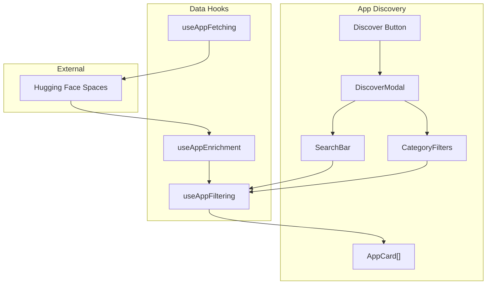
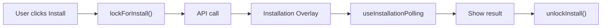

# Application Store Module

Module for managing Reachy Mini applications: discovery, installation, and management.

## 📁 Structure

```
application-store/
├── ApplicationStore.jsx          # Main component (orchestration)
├── DiscoverModal.jsx             # Fullscreen modal for app discovery
├── discover/                     # Discovery-related components
│   ├── Modal.jsx                # Discover modal wrapper
│   ├── Section.jsx              # Discover section (compact view)
│   ├── Button.jsx               # Button to open discover modal
│   ├── index.js                 # Discover exports
│   └── components/              # Discover modal sub-components
│       ├── Header.jsx           # Modal header with title and description
│       ├── SearchBar.jsx        # Search and filter controls
│       ├── CategoryFilters.jsx  # Category filter chips
│       ├── AppCard.jsx          # App card display
│       ├── EmptyState.jsx       # Empty state when no results
│       └── Footer.jsx           # Modal footer with actions
├── installed/                    # Installed apps management
│   ├── InstalledAppsSection.jsx # Section displaying installed apps
│   └── index.js                 # Installed exports
├── installation/                 # Installation process
│   ├── Overlay.jsx              # Fullscreen installation overlay
│   └── index.js                 # Installation exports
├── modals/                       # Additional modals
│   ├── CreateAppTutorial.jsx    # Tutorial for creating apps
│   └── index.js                 # Modal exports
├── quick-actions/                # Quick action components
│   ├── Donut.jsx                # Donut-shaped quick actions
│   ├── Pad.jsx                  # Pad quick actions
│   ├── HandwrittenArrows.jsx    # Arrow indicators
│   └── index.js                 # Quick actions exports
├── hooks/                        # Business logic hooks
│   ├── useApps.js               # Main apps orchestration hook
│   ├── useAppsStore.js          # Store connection hook
│   ├── useAppFetching.js        # App list fetching
│   ├── useAppFiltering.js       # Search and category filtering
│   ├── useAppEnrichment.js      # Enrich apps with metadata
│   ├── useAppHandlers.js        # Install/uninstall handlers
│   ├── useAppInstallation.js    # Installation state management
│   ├── useAppJobs.js            # Job tracking and polling
│   ├── useAppLogs.js            # App logs management
│   ├── useModalStack.js         # Modal stack management
│   ├── index.js                 # Hook exports
│   ├── installation/            # Installation-specific hooks
│   │   ├── constants.js         # Installation constants
│   │   ├── helpers.js           # Pure helper functions
│   │   ├── useInstallationLifecycle.js  # Installation lifecycle
│   │   ├── useInstallationPolling.js    # Polling for completion
│   │   └── README.md            # Installation module docs
│   └── utils/                   # Hook utilities
│       └── appMetadata.js       # App metadata helpers
└── index.js                      # Main exports
```

## 🎯 Architecture

### Main Component

- **ApplicationStore**: Main orchestrator component
  - Manages app state (installed, available)
  - Handles installation/uninstallation
  - Coordinates modals and overlays
  - Props: `isActive`, `darkMode`, etc.

### Hooks Overview

| Hook | Responsibility |
|------|---------------|
| **useApps** | Main orchestration hook, combines all others |
| **useAppsStore** | Connect to Zustand store for app state |
| **useAppFetching** | Fetch apps from Hugging Face Spaces |
| **useAppFiltering** | Filter apps by search query and category |
| **useAppEnrichment** | Enrich app data with metadata |
| **useAppHandlers** | Handle install/uninstall/start/stop actions |
| **useAppInstallation** | Manage installation overlay state |
| **useAppJobs** | Track background jobs (install/remove) |
| **useAppLogs** | Manage app log display |
| **useModalStack** | Manage modal open/close stack |

### Discovery Flow



### Installation Flow



1. **Installation Overlay**: Fullscreen overlay during installation
   - Shows progress and logs
   - Handles success/error states
   - Minimum display time for UX

2. **Installed Apps Section**: Management of installed apps
   - List of installed apps
   - Start/stop controls
   - Uninstall functionality
   - App logs integration

### Quick Actions

- **Donut**: Circular quick actions interface
- **Pad**: Pad-style quick actions
- Used in various contexts (discovery, installed apps)

## 🔧 Key Features

### App Discovery

- Fetches from Hugging Face Spaces (reachy_mini tag)
- Search by name/description
- Category filtering
- Official apps filter toggle
- Real-time installation status

### Installation Management

- Automatic installation from discovery
- Progress tracking via job polling
- Error handling and retry
- Minimum display time for smooth UX

### App Management

- Start/stop running apps
- View app logs in real-time
- Uninstall apps
- Status indicators (running, error, etc.)

## 📦 Exports

```javascript
// Main component
import ApplicationStore from '@views/active-robot/application-store';

// Hooks
import { 
  useApps,
  useAppsStore,
  useAppFetching,
  useAppFiltering,
  useAppEnrichment,
  useAppHandlers,
  useAppInstallation,
  useAppJobs,
  useAppLogs,
  useModalStack
} from '@views/active-robot/application-store/hooks';

// Components
import { DiscoverModal } from '@views/active-robot/application-store';
import { InstalledAppsSection } from '@views/active-robot/application-store/installed';
import { InstallationOverlay } from '@views/active-robot/application-store/installation';
```

## 🎨 Design Patterns

- **Fullscreen Overlays**: Used for modals and installation to focus user attention
- **Minimum Display Times**: Ensures smooth UX transitions (no flickering)
- **Centralized State**: Uses Zustand store for app state management
- **Component Composition**: Small, focused components composed into larger features
- **Hook Separation**: Each hook has a single responsibility

## 🔗 Dependencies

- `@store/useAppStore`: Global state management
- `@components/FullscreenOverlay`: Overlay component
- `@utils/huggingFaceApi`: Hugging Face API utilities

## 📚 Related Documentation

- [Installation Module](./hooks/installation/README.md) - Detailed installation flow docs
