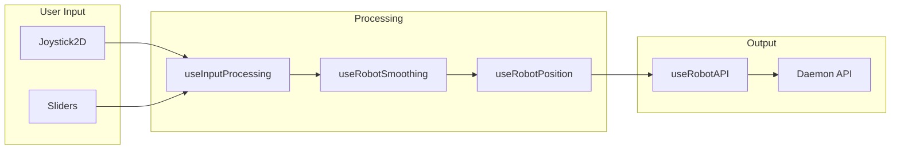

# Controller Module

Module for controlling the position and orientation of the Reachy Mini robot head.

## 📁 Structure

```
controller/
├── Controller.jsx              # Main component (orchestration)
├── components/                 # Reusable UI components
│   ├── Joystick2D.jsx         # 2D joystick control (X/Y or Pitch/Yaw)
│   ├── VerticalSlider.jsx     # Vertical slider (Position Z)
│   ├── SimpleSlider.jsx       # Horizontal slider (Roll, Body Yaw)
│   ├── CircularSlider.jsx     # Circular slider for rotation
│   └── index.js               # Component exports
├── hooks/                      # Business logic hooks
│   ├── useRobotPosition.js    # Main position control hook
│   ├── useRobotAPI.js         # API communication hook
│   ├── useRobotSmoothing.js   # Input smoothing logic
│   ├── useRobotSync.js        # State synchronization
│   ├── useActiveMoves.js      # Active moves tracking
│   ├── useInputProcessing.js  # Input processing and normalization
│   ├── usePositionHandlers.js # Position change handlers
│   └── index.js               # Hook exports
├── utils/                      # Helper utilities
│   ├── formatPose.js          # Pose formatting for logs
│   ├── intelligentLogging.js  # Smart logging with throttling
│   └── index.js               # Utility exports
└── index.js                    # Main export
```

## 🎯 Architecture

### Main Component

- **Controller**: Orchestration and layout
  - Props: `isActive`, `darkMode`, `onResetReady`, `onIsAtInitialPosition`
  - Manages joystick and slider states
  - Coordinates API calls with smoothing

### UI Components

| Component | Purpose | Controls |
|-----------|---------|----------|
| **Joystick2D** | 2D control area | Position X/Y, Pitch/Yaw |
| **VerticalSlider** | Vertical slider | Position Z (height) |
| **SimpleSlider** | Horizontal slider | Roll, Body Yaw |
| **CircularSlider** | Circular slider | Rotation angles |

### Business Logic Hooks

| Hook | Responsibility |
|------|---------------|
| **useRobotPosition** | Main position state and API commands |
| **useRobotAPI** | HTTP calls to daemon API (`/api/move/set_target`) |
| **useRobotSmoothing** | Smooth input transitions (lerp) |
| **useRobotSync** | Sync local state with robot state |
| **useActiveMoves** | Track active movements from store |
| **useInputProcessing** | Normalize and process raw inputs |
| **usePositionHandlers** | Handle position change events |

### Utilities

| Utility | Purpose |
|---------|---------|
| **formatPoseForLog** | Format pose data for readable logs |
| **hasSignificantChange** | Detect significant pose changes |
| **intelligentLogging** | Throttled logging to reduce noise |

## 🔧 Usage

```jsx
import Controller from '@views/active-robot/controller';

<Controller 
  isActive={isActive}
  darkMode={darkMode}
  onResetReady={handleResetReady}
  onIsAtInitialPosition={handleIsAtInitialPosition}
/>
```

## 📦 Exports

```javascript
// Main component
import Controller from '@views/active-robot/controller';

// Individual components
import { 
  Joystick2D, 
  VerticalSlider, 
  SimpleSlider, 
  CircularSlider 
} from '@views/active-robot/controller/components';

// Hooks
import { 
  useRobotPosition, 
  useRobotAPI, 
  useRobotSmoothing, 
  useRobotSync, 
  useActiveMoves,
  useInputProcessing,
  usePositionHandlers
} from '@views/active-robot/controller/hooks';

// Utils
import { 
  formatPoseForLog, 
  hasSignificantChange,
  intelligentLogging 
} from '@views/active-robot/controller/utils';
```

## 🎮 Control Flow



## ⚡ Performance

- **requestAnimationFrame**: Continuous animation loop for smooth updates
- **Throttled API calls**: Prevents flooding the daemon
- **Intelligent logging**: Reduces console noise in production
- **Memoized components**: Prevents unnecessary re-renders
